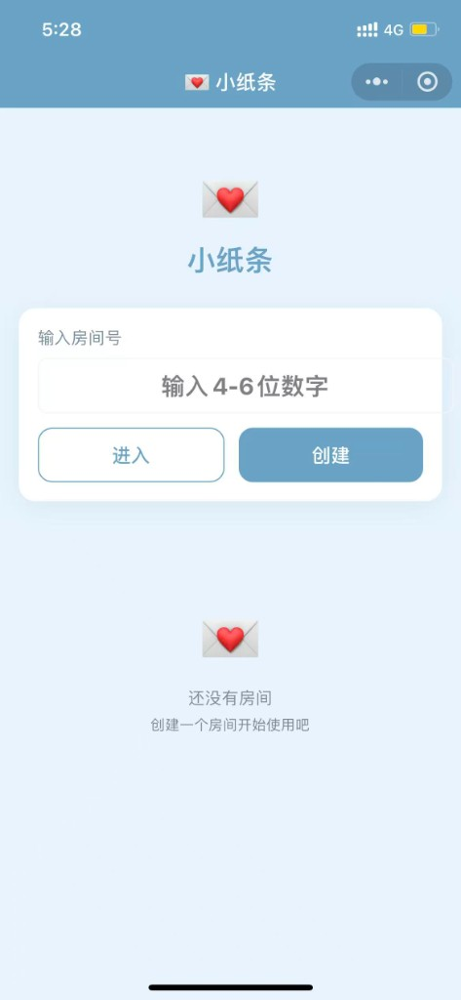
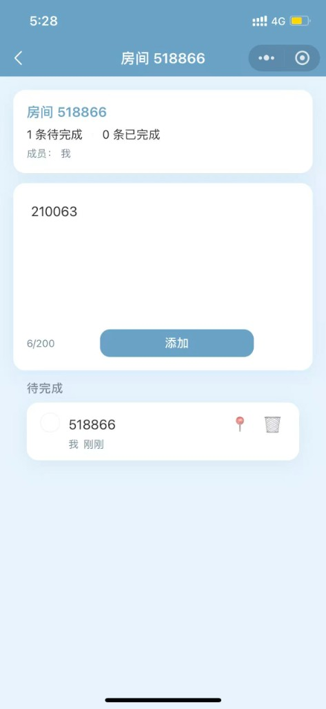
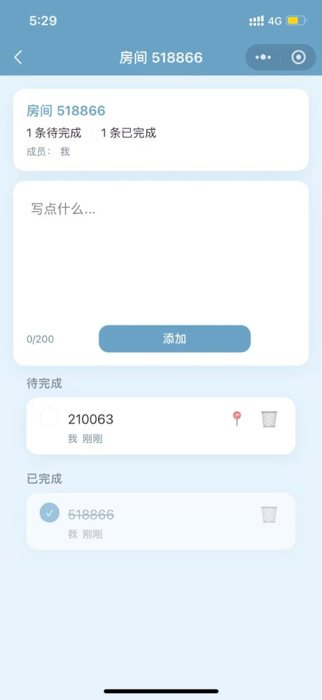

# 💌 小纸条

> 基于微信云开发的共享小纸条小程序，适合情侣、室友或家人一起记录待办、生活事项与共同计划。

[](LICENSE)
[](https://developers.weixin.qq.com/miniprogram/dev/framework/)
[](https://developers.weixin.qq.com/miniprogram/dev/wxcloud/basis/getting-started.html)

## 简介

**小纸条** 是一款轻量、无广告的微信小程序。通过房间号即可创建或加入协作空间，双方可实时查看、添加和完成小纸条。项目使用微信云开发（CloudBase），无需自建服务器，免费额度即可运行。

**适用场景：** 情侣待办、家庭购物清单、合租家务分工、两人协作的小计划。

## 界面预览

| 首页 | 房间 · 待完成 | 房间 · 已完成 |
|:---:|:---:|:---:|
|  |  |  |

## 特性

- 房间号创建 / 加入，4–6 位数字即可协作
- 小纸条增删改查，单条最多 200 字
- 待完成 / 已完成分组，一目了然
- 置顶小纸条，重要事项不遗漏
- 显示创建者与时间，多人协作更清晰
- 云函数鉴权，数据安全可控
- 无广告、无付费，体验版即可私用
## 技术栈

- 微信小程序原生开发
- WXML + WXSS + JavaScript
- 微信云开发 CloudBase
- 云数据库
- 云函数

## 项目结构

```
.
├── cloudfunctions/          # 云函数目录
│   ├── login/              # 用户登录
│   ├── createRoom/         # 创建房间
│   ├── joinRoom/           # 加入房间
│   ├── getMyRooms/         # 获取我的房间
│   ├── getRoomInfo/        # 获取房间信息
│   ├── addTodo/            # 添加小纸条
│   ├── getTodos/           # 获取小纸条列表
│   ├── toggleTodo/         # 切换完成状态
│   ├── updateTodo/         # 更新小纸条
│   ├── deleteTodo/         # 删除小纸条
│   └── pinTodo/            # 置顶小纸条
├── pages/                  # 页面目录
│   ├── index/             # 首页（房间列表）
│   ├── room-detail/       # 房间详情页
│   ├── join/              # 加入房间页
│   ├── mine/              # 我的页面
│   └── import-data/       # 数据导入页
├── app.js                 # 小程序入口
├── app.json               # 小程序配置
├── app.wxss               # 全局样式
├── local.config.example.js # 云环境配置示例（复制为 local.config.js）
└── 部署指南.md             # 详细部署文档
```

## 快速开始

1. **克隆项目**

```bash
git clone https://github.com/1183213030/To-do-list-note.git
```

2. **用微信开发者工具打开项目目录**

3. **配置云开发环境 ID**

```bash
cp local.config.example.js local.config.js
```

编辑 `local.config.js`，填入你的云开发环境 ID：

```javascript
module.exports = {
  cloudEnv: 'your-env-id'  // 替换为你的环境 ID
}
```

> `local.config.js` 已加入 `.gitignore`，不会提交到 Git，可安全保存个人配置。

4. **按 [部署指南.md](./部署指南.md) 完成云开发开通、数据库创建与云函数部署**

5. **编译运行**，上传体验版并添加体验成员即可使用

## 数据库集合

需要在云开发控制台创建以下集合：

1. **rooms** - 房间信息
2. **room_members** - 房间成员关系
3. **todos** - 小纸条内容

## 部署步骤

### 1. 开通云开发

1. 在微信开发者工具中打开项目
2. 点击「云开发」按钮
3. 创建云开发环境（免费版即可）
4. 记下环境 ID

### 2. 配置环境 ID

复制 `local.config.example.js` 为 `local.config.js`，填入你的云开发环境 ID（详见上方「快速开始」）。

### 3. 创建数据库集合

在云开发控制台 - 数据库中，手动创建以下集合：
- rooms
- room_members
- todos

### 4. 上传云函数

在微信开发者工具中，右键每个云函数文件夹，选择：
1. 「云函数」→「上传并部署：云端安装依赖」

需要上传的云函数：
- login
- createRoom
- joinRoom
- getMyRooms
- getRoomInfo
- addTodo
- getTodos
- toggleTodo
- updateTodo
- deleteTodo
- pinTodo

### 5. 测试运行

1. 点击「编译」按钮
2. 在模拟器中测试功能
3. 使用真机调试测试完整流程

### 6. 生成体验版

1. 点击「上传」按钮上传代码
2. 登录微信公众平台
3. 进入「版本管理」
4. 将上传的版本设置为体验版
5. 添加体验成员（你和对象的微信号）

## 核心功能

### 房间功能
- ✅ 创建房间，自动生成 4–6 位房间号
- ✅ 输入房间号进入或加入
- ✅ 查看我的房间列表与成员
- ✅ 房间待完成 / 已完成统计

### 小纸条功能
- ✅ 添加小纸条（最多 200 字）
- ✅ 完成 / 取消完成
- ✅ 置顶重要小纸条
- ✅ 删除小纸条
- ✅ 显示创建者与时间

### 数据管理
- ✅ 数据导出 - 导出房间与小纸条数据
- ✅ 数据导入 - 从 JSON 恢复数据
- ✅ 清除本地缓存

## 使用流程

### 基本流程
1. 用户 A 打开小程序，点击「创建」生成房间号（如 `518866`）
2. 用户 A 在房间内写下小纸条「周末买东西」
3. 用户 A 将房间号告诉用户 B
4. 用户 B 在首页输入房间号，点击「进入」并加入房间
5. 用户 B 可以看到用户 A 写的小纸条
6. 用户 B 添加小纸条「晚上拿快递」
7. 双方都可以完成、置顶或删除小纸条

### 数据导出流程
1. 进入「我的」页面
2. 点击「导出数据」
3. 系统自动复制 JSON 数据到剪贴板
4. 妥善保存导出的数据

### 数据导入流程
1. 进入「我的」页面
2. 点击「导入数据」
3. 粘贴之前导出的 JSON 数据
4. 点击「确认导入」
5. 系统自动校验并导入数据

## 注意事项

1. **仅供私用**：本项目不做正式发布，仅供体验版使用
2. **无需付费**：完全使用微信云开发免费额度
3. **数据安全**：所有权限校验在云函数中进行
4. **无广告**：项目纯净无广告
5. **环境 ID**：记得配置正确的云开发环境 ID
6. **数据备份**：支持数据导出功能，建议定期备份
7. **免费政策**：免费云环境活动截止 2026 年 12 月 31 日，后续以官方通知为准
8. **数据迁移**：如未来免费政策变化，可通过导出功能迁移数据

## 后续扩展（可选）

如需扩展功能，可以考虑：
- 房间分享卡片 / 扫码加入
- 小纸条编辑功能
- 订阅消息提醒
- 房间锁定与权限管理
- 数据导出导入完善

## 技术支持

如遇到问题：
1. 检查云函数是否全部上传成功
2. 检查数据库集合是否创建
3. 检查云开发环境 ID 是否正确
4. 查看云函数日志排查错误

## 相关链接

- [微信公众平台](https://mp.weixin.qq.com/)
- [微信开发者工具下载](https://developers.weixin.qq.com/miniprogram/dev/devtools/download.html)
- [微信云开发文档](https://developers.weixin.qq.com/miniprogram/dev/wxcloud/basis/getting-started.html)

## 许可

详见 [LICENSE](LICENSE)。本项目仅供个人学习和非商业私用。
